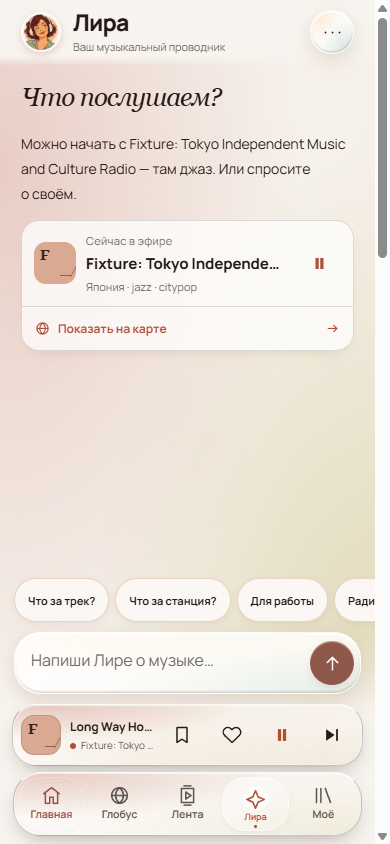
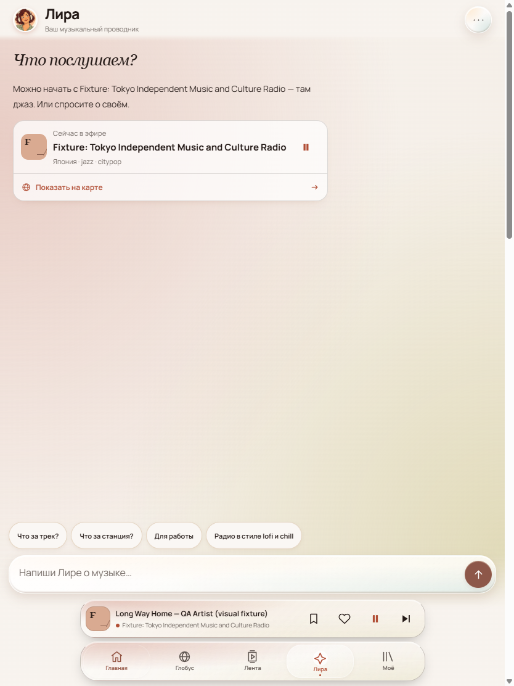
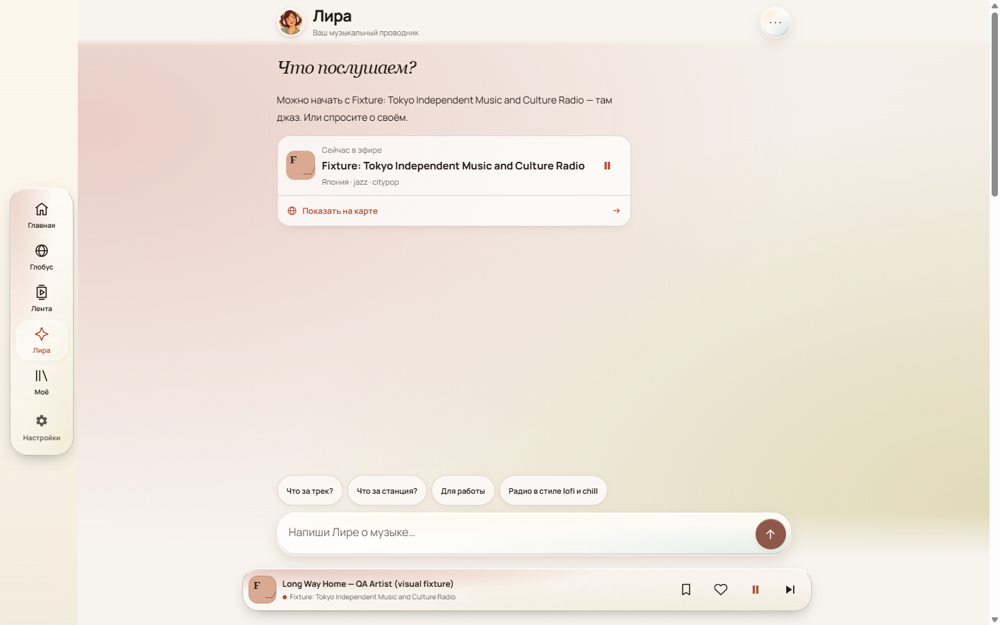
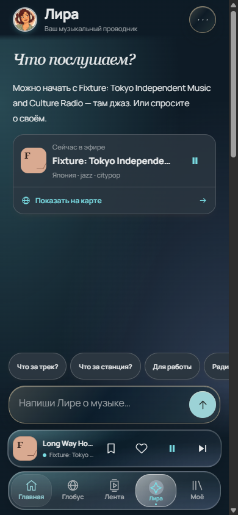

# Лира: продолжение подбора и доступный плеер — 08.10.2026

Исправление поведения существующего интерфейса; новая композиция не добавляется.
Код — GPT-6 Luna, диагностика, независимая проверка и выпуск — main;
существенную API правку дополнительно проверила GPT-6 Astra.

## Что меняется для слушателя

- Уточнение «не 90-ые, а что-то с 2000 по 2014» продолжает предыдущий подбор
  радио, сохраняет его жанр/страну и возвращает доступные карточки станций.
  Эпоха извлекается только из ограниченных USER turns. Запросы справки и
  отрицательные условия не превращаются в согласие на подбор/воспроизведение.
- Подтверждённые метаданные эпохи участвуют в поиске до ограничения выдачи;
  жанр не заменяется эпохой. Ограниченный refill восстанавливает подходящие
  строки за первой страницей. Неизвестный период не считается подтверждённым;
  десятилетие в тегах не гарантирует конкретный трек или точный год живого эфира.
- В bounded-evidence ответе названия, страны и списки тегов больше не дублируют
  карточки. Короткий музыкальный комментарий строится из проверяемого словаря
  жанров. Одинаковые теги не выдаются за доказательство различий звучания.
- Тап по мини-плееру из Лиры закрывает чат и открывает текущую станцию в Ленте.
  Сохраняются звук, очередь и переписка при возвращении в Лиру.
- Сердечко станции доступно прямо в мини-плеере; закладка трека остаётся отдельной.
  Сердце не запускает звук, не переключает станцию и не меняет очередь.

## Проверено

Чистый release checkout от актуального origin/master; отдельный backport,
без непринятых Library/Studio/image изменений рабочей ветки.

- Source/test typechecks — passed. Полный API — 900 passed.
- Webapp units — 948 passed. Полный functional Playwright — 444 passed,
  7 штатных skipped (451 всего); новые семь регрессий входят в этот прогон.
- Offline Lira — 24/24, modelCalls=0.
- Реальный chatWithAssistant → createCatalogToolProvider → buildSearchResponse:
  точное уточнение эпохи возвращает UUID карточек; jazz+era и semantic jazz+era
  находят нужную станцию за 25/30 ранжированными строками 90-х, не пропуская pop.
  Никакого Play по истории. Проверены отрицания, замена периода, fact barriers,
  EN/RU, одинаковые теги и distinction deep/progressive house.
- Main самостоятельно нажал переход и сердце в браузере production-сборки,
  просмотрел 390×844, 834×1112 и 1440×900 в journal и тёмной теме.
  Зоны четырёх действий 44×44, без перекрытия composer/nav; длинный текст
  сокращается, сердечко и закладка визуально различимы. Старое свободное поле
  чата остаётся старой композицией, не объявляется новым/принятым дизайном.
- React quality review: hooks остаются безусловными; обработчик перехода общий;
  type-only props, aria-label/pressed, исключение действий из dock swipe.

Снимки ниже — синтетическая станция/длинный трек, media play/pause mocked.
Это доказательство интерфейса, не реального декодированного звука.
Локальный screenshot helper не подменял listening/live и резервные metadata
запросы fixture stream.example, поэтому preview без API писал 502; проверка
перехода и сохранения состояния завершилась, изолированные браузеры закрыты.

## Границы

Живой платный прогон в этом участке не запускался: новое согласование бюджета
ожидается, старые журналы закрыты. Поведение настоящего composer и звучание
конкретных станций нельзя считать доказанными тестовыми ответами.
Сброс чата владельцем дал удачный отдельный запрос Amiga; это не повтор
той же цепочки про 2000–2014 и не оправдание требовать очистку истории.
Физический iPhone после звонка остаётся отдельным открытым пунктом.

## Предыдущий выпуск надёжности

`a653d54` действительно опубликован 08.10: CI37369724677 зелёный, deploy37369724539
повторён после отказа GitHub выдать hosted runner 05.10, same-SHA gate и deploy
success. RU current, public health и публичный bundle marker проверены.
12 PNG pixel-report совпадают побайтно с предыдущим CI; старые baseline
различия и Page.captureScreenshot не исправлялись обновлением эталонов.

Текущий выпуск этой правки подтверждать только после same-SHA CI/deploy и
проверки публичного bundle + RU current; локальный коммит не равен публикации.
